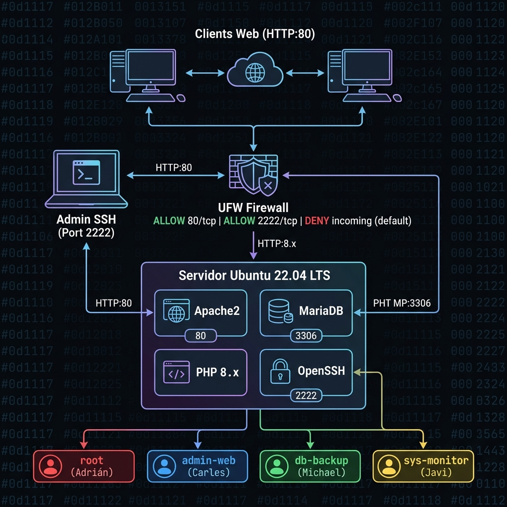

# 🖥️ Bienvenidos a SRE-Docs

**Documentación y Despliegue de Servidores** es un proyecto de simulación de infraestructura empresarial desarrollado en el marco del módulo de **Sistemas de la Información** de 1º ASIR.

El objetivo de este portal es documentar de manera clara y profesional el despliegue de un servidor corporativo con pila **LAMP** (Linux, Apache, MariaDB y PHP), así como las medidas de seguridad y gestión de usuarios aplicadas.

---

## 📋 Descripción del Proyecto

El proyecto simula el entorno real de una empresa en producción, donde se configura un servidor Ubuntu/Debian con los servicios mínimos necesarios para alojar una aplicación web. Se han aplicado buenas prácticas de seguridad, principio de mínimo privilegio y documentación de todo el proceso.

| Elemento          | Detalle                              |
|------------------|--------------------------------------|
| **Sistema Operativo** | Ubuntu 22.04 LTS Server         |
| **Pila de Servicios** | LAMP (Apache2, MariaDB, PHP 8.x) |
| **Gestión de Acceso** | Usuarios con roles diferenciados  |
| **Seguridad** | UFW Firewall + Hardening SSH         |
| **Metodología** | Scrum (sprints semanales)            |

---

## 👥 Equipo de Trabajo

El proyecto ha sido desarrollado por un equipo de cuatro personas, cada una con un rol técnico y un usuario del sistema asignado:

### 🔴 Adrián — Scrum Master / `root`

- **Rol en el proyecto:** Scrum Master y líder técnico. Coordina las tareas semanales, gestiona el repositorio y supervisa el despliegue global.
- **Usuario del sistema:** `root`
- **Permisos:** Acceso total al servidor. Responsable de la configuración inicial y de las tareas de administración sistémica.

---

### 🔵 Carles — Administrador Web / `admin-web`

- **Rol en el proyecto:** Administrador del servidor web Apache. Gestiona los ficheros de la web, las configuraciones de virtual hosts y el directorio público.
- **Usuario del sistema:** `admin-web`
- **Permisos:** Propietario del directorio `/var/www/html`. Sin acceso a la base de datos ni a los logs del sistema.

---

### 🟢 Michael — Seguridad y Backups / `db-backup`

- **Rol en el proyecto:** Responsable de la seguridad de la base de datos y de las copias de seguridad. Configura y ejecuta los scripts de `mysqldump`.
- **Usuario del sistema:** `db-backup`
- **Permisos:** Acceso de lectura a las bases de datos de MariaDB para realizar copias. Sin acceso al sistema de ficheros web.

---

### 🟡 Javi — Auditor del Sistema / `sys-monitor`

- **Rol en el proyecto:** Responsable de la auditoría y monitorización del servidor. Revisa los logs del sistema para detectar errores o actividad sospechosa.
- **Usuario del sistema:** `sys-monitor`
- **Permisos:** Lectura de ficheros de log (`/var/log`). Sin permiso de escritura en ningún directorio del sistema.

---

## 🗺️ Esquema de la Red

A continuación se muestra el diagrama de la arquitectura de red de la infraestructura simulada:

> **Nota:** El esquema muestra la topología de red con el servidor LAMP en el centro, el firewall UFW como primera capa de protección y los clientes que acceden vía HTTP y SSH.

---

## 🗂️ Contenido del Portal

| Sección | Descripción |
|--------|-------------|
| [⚙️ Configuración de Servidores](servidors.md) | Instalación paso a paso de la pila LAMP |
| [👤 Gestión de Roles y Usuarios](usuaris.md) | Creación de usuarios y asignación de permisos |
| [🔒 Seguridad y Hardening](seguretat.md) | Configuración del firewall y endurecimiento SSH |

---

!!! info "Metodología Scrum"
    El proyecto se ha gestionado con **Scrum**, dividiendo el trabajo en sprints semanales. Cada miembro del equipo tenía tareas asignadas que se revisaban en reuniones diarias de seguimiento (*daily standups*).
